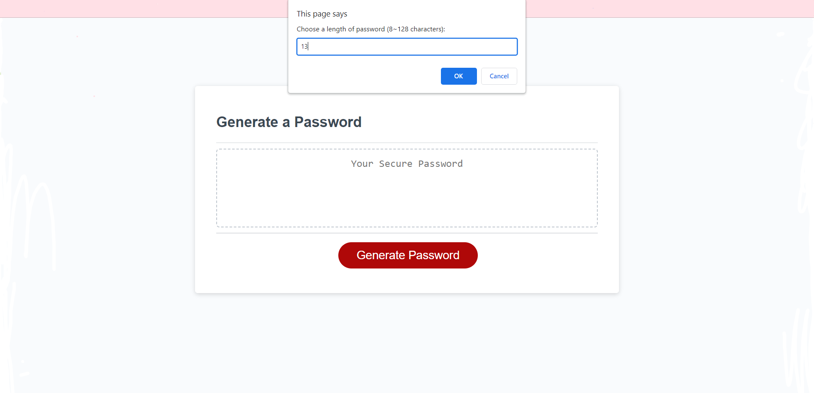
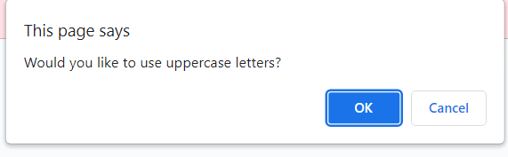
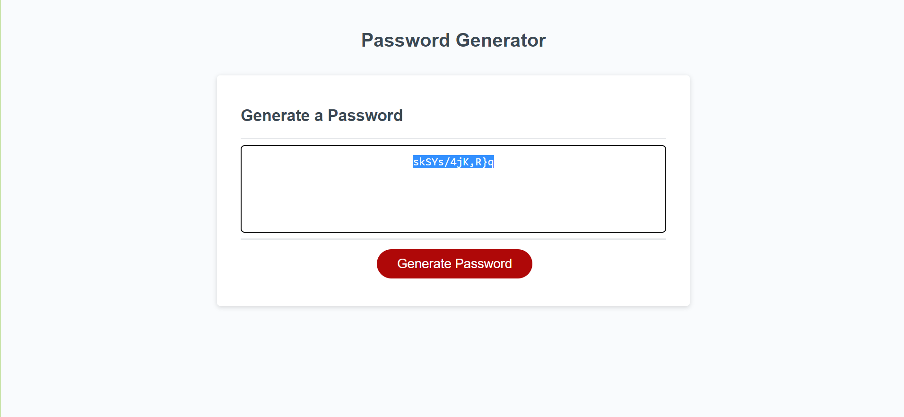
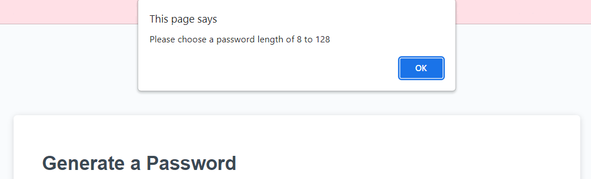
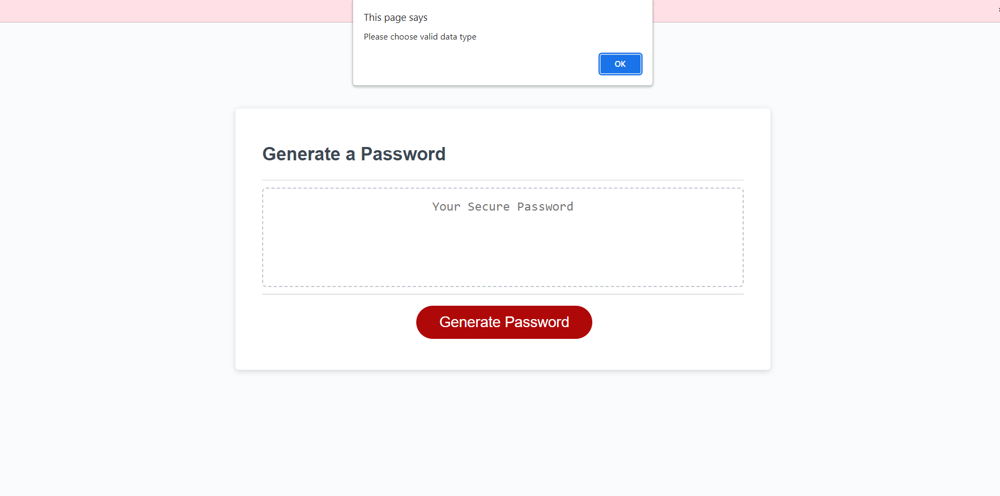

# Password Generator

## Description 

This webpage uses JavaScript to generate a random password, given the parameters provided by the user. Clicking the red "Generate Password" button, a series of prompts requesting user input regarding length of password and types of caracters to use before outputting a random password, using the specified parameters. The series of sequences will look like the following screenshots: 

After inputting desired parameters, the randomly generated password will appear in the generate password box" 

The user must then copy (command+c for MacOS or control+c for Windows) and paste (command+v for MacOS or control+v for Windows) the password into a password creation box when creating a new account for something. The user is then advised to use a password keycahin feature installed in most computers to save the password. 

If a user inputs an invalid value for password length, the following pop up will appear: 

If a user chooses to allow no characters, the following pop up wil appear: 

By finishing this project, I was able to practice using JavaScript basics learned from class. I was able to experiment with different logic configuations to get the same desired output. 

---
## Table of Contents

- [Installation](#installation)
- [Usage](#usage)
- [Credits](#credits)
- [License](#license)

---

## Installation

N/A

## Usage

To navigate to this webpage, please [click here](https://anna-dxj.github.io/md2-friendly-parakeet/). The website should appear like the screenshot below: 

To access Chrome DevTools, access the webpage from Google Chrome and press Command+Option+I (MacOS) or Control+Shift+I (Windows). A console will appear on teh webpage, and you may inspect the structure of the webpage through the console. 

## Credits

Tutor Alexis Gonzalez was consulted and helped in clarifying some logic and altenrate ways to have the same output. 

The website MDN was also consulted often. I used MDN's try it feature particularly to run certain parts of code in isolation to experiment and ensure it would work. I also consulted [MDN](https://developer.mozilla.org/en-US/docs/Web/JavaScript/Reference/Operators/Addition_assignment) to see the += assigner's function. 

## License

MIT License

Copyright (c) [2022] [Anna Langford]

Permission is hereby granted, free of charge, to any person obtaining a copy
of this software and associated documentation files (the "Software"), to deal
in the Software without restriction, including without limitation the rights
to use, copy, modify, merge, publish, distribute, sublicense, and/or sell
copies of the Software, and to permit persons to whom the Software is
furnished to do so, subject to the following conditions:

The above copyright notice and this permission notice shall be included in all
copies or substantial portions of the Software.

THE SOFTWARE IS PROVIDED "AS IS", WITHOUT WARRANTY OF ANY KIND, EXPRESS OR
IMPLIED, INCLUDING BUT NOT LIMITED TO THE WARRANTIES OF MERCHANTABILITY,
FITNESS FOR A PARTICULAR PURPOSE AND NONINFRINGEMENT. IN NO EVENT SHALL THE
AUTHORS OR COPYRIGHT HOLDERS BE LIABLE FOR ANY CLAIM, DAMAGES OR OTHER
LIABILITY, WHETHER IN AN ACTION OF CONTRACT, TORT OR OTHERWISE, ARISING FROM,
OUT OF OR IN CONNECTION WITH THE SOFTWARE OR THE USE OR OTHER DEALINGS IN THE
SOFTWARE.
